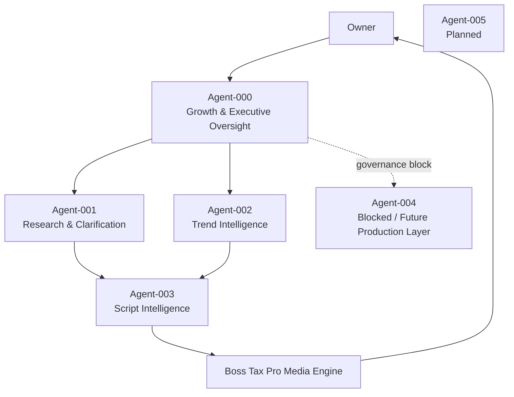

# CASE-008 — Boss Tax Pro AI Agent Studio

**Status:** PILOT ACTIVE  
**Last updated:** July 30, 2026  
**Role:** Systems architect, AI agent engineer, release manager, QA lead, and product owner

## Overview

I designed and operated a governed multi-agent AI system for Boss Tax Pro, a tax and bookkeeping education brand. The project is not a single chatbot or a collection of prompts. It is a versioned software-and-governance program that separates research, trend intelligence, script production, media operations, executive oversight, and Owner approval into distinct responsibilities.

The core engineering goal is simple: make AI useful enough to accelerate real work without allowing it to invent current tax facts, blur authority boundaries, overwrite approved releases, or silently publish unreviewed content.

## The challenge

The media workflow depended on current IRS research, calculations, bookkeeping context, competitor analysis, long-form scripts, short-form repurposing, production direction, and publication controls. Combining all of that inside one general-purpose prompt created several risks:

- current-law claims could be stated without primary-source verification;
- calculations could be mixed with creative writing;
- one agent could accidentally approve or modify another;
- working releases could be overwritten during repair attempts;
- test counts, version metadata, manifests, and delivered ZIPs could disagree;
- creative outputs could pass structural checks while still sounding generic;
- downstream content could consume stale or unapproved records.

## System architecture

Each agent has one primary job, explicit routing rules, prohibited actions, release status, and an Owner-controlled approval boundary.

## What I built

### 1. Governed agent lifecycle

- Defined mission, inputs, outputs, dependencies, authority boundaries, and stop conditions for each agent.
- Created a five-file maximum handoff standard to reduce duplicate inputs and contradictory versions.
- Separated technical certification, controlled shadow use, operational pilots, production authority, and publication authority.
- Designed status vocabularies such as `RESEARCH_REQUIRED`, `BLOCKED`, `OWNER_REVIEW_REQUIRED`, and versioned release-candidate states.
- Preserved immutable baselines and required higher-version releases for every correction.

### 2. Release engineering and validation

- Used semantic versioning, immutable ZIP baselines, SHA-256 identity checks, detached attestations, manifests, and secret scans.
- Required exact-final-ZIP testing after packaging instead of relying on pre-package test results.
- Validated clean extraction, offline installation, CLI execution, archive inventory, unsafe paths, duplicate entries, and checksum integrity.
- Diagnosed and repaired release-identity defects, `src/`-layout import failures, stale validation records, and self-referential checksum designs.
- Kept builder self-attestation separate from independent review and Owner approval.

### 3. Agent-001 research and evidence pipeline

Agent-001 v1.0.2 became the first fully tested research agent in the program.

**Release evidence**

- 35/35 genuine pytest tests passed
- 16/16 canonical CLI commands passed
- 8/8 functional scenarios passed
- manifest, checksums, secret scan, archive inventory, clean extraction, and clean installation passed
- six controlled shadow assignments completed
- limited operational pilot activated with ten governed slots

**Pilot progress**

- Assignment 01: current federal Form 1099 reporting-threshold evidence packet — Owner approved with limitations
- Assignment 02: qualified tips and overtime verification — executed and pending Owner review

The agent is permitted to perform internal research, source mapping, calculation verification, missing-fact analysis, and evidence preparation. It still cannot publish, provide final client-specific advice, independently sign off tax positions, certify other agents, or release downstream agents.

### 4. Creative-layer separation

I separated evidence from performance instead of asking one model to do both jobs.

- Agent-001 controls sources, dates, calculations, qualifications, and uncertainty.
- Agent-003 will control narrative planning and long-form script production after its implementation gate is released.
- The `boss-competitive-voice` Skill defines an energetic, evidence-backed character standard without changing verified tax facts.
- The Boss Tax Pro Media Engine Skill coordinates research intake, scripting, SEO, publishing workflows, analytics, and Owner review.
- Deterministic gates protect facts, math, schemas, packaging, and release integrity; model-driven layers handle creative judgment.

## Current program status

| Component | Current governed status |
|---|---|
| Agent-000 v1.1.2 | Controlled shadow operation |
| Agent-001 v1.0.2 | Limited operational pilot active |
| Agent-001 Pilot Assignment 01 | Owner approved with limitations |
| Agent-001 Pilot Assignment 02 | Executed; Owner review pending |
| Agent-002 | Re-certification waiting |
| Agent-003 v2 | Held at implementation gate |
| Agent-004 | Blocked |
| Agent-005 | Planned |
| Boss Tax Pro Media Engine Skill | Built, validated, and packaged |
| Boss competitive voice Skill | Built, validated, and reserved for Agent-003 integration |

## Skills demonstrated

- AI agent architecture and orchestration
- prompt and instruction engineering
- Python package and CLI validation
- pytest test design and failure diagnosis
- JSON/CSV schema and governed-record design
- semantic versioning and immutable-release management
- SHA-256 manifests and detached attestations
- source verification and evidence provenance
- security-minded secret and credential scanning
- Git/GitHub release documentation
- technical writing and operator runbooks
- human-in-the-loop approval workflows
- root-cause analysis across environment, code, packaging, governance, and documentation layers

## Integrity and security controls

- No real credentials, private tax records, or client data are published in this repository.
- Public documentation describes architecture and verified milestones without exposing proprietary agent packages.
- Every high-risk current claim requires authoritative-source verification and an effective date.
- A passing test suite does not grant production or publication authority.
- Owner decisions and downstream agent releases remain explicit, separate governance actions.

## Result

The project now has a repeatable path from live authoritative research to governed evidence packets and, eventually, creative production. The system demonstrates how I approach technical operations: define ownership, control change, verify the exact artifact, preserve working baselines, document limitations honestly, and route unresolved risk to the right decision-maker.

## Next milestones

1. Complete and review the remaining Agent-001 pilot assignments.
2. Re-certify Agent-002 trend intelligence.
3. Build and independently audit Agent-003 v2 with the hybrid narrative engine and Boss voice standard.
4. Connect approved evidence packets to the Media Engine while preserving Owner publication gates.
5. Add milestone updates here and to [willieminor.com](https://willieminor.com) as the program advances.
